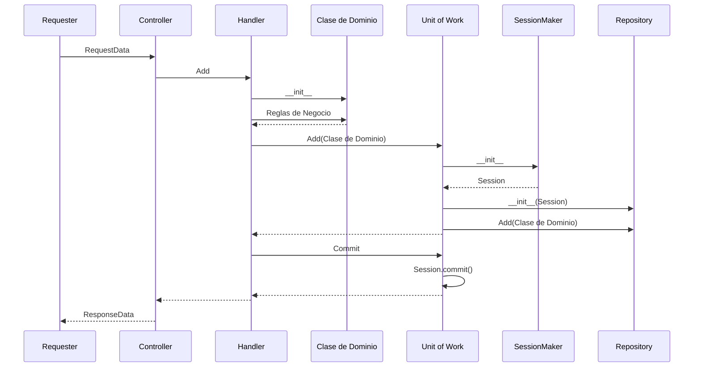

# Plantilla para microservicios

Este repositorio contiene la plantilla básica con los patrones DDD (Domain Driven Design) recomendados para esta arquitectura.

## Instalación

Este repositorio no se debe de clonar, copiar el código en una nueva carpeta donde se creará un nuevo repositorio para el servicio que se esté creando. Cuando se copie el código antes de agregarlo a git se debe de asegurar que no existe la carpeta *app/common*.

Después de crear el nuevo repositorio en Git se debe de crear un submódulo a partir del repositorio *api-common* con el siguiente comando (se debe ejecutar desde la carpeta **app**):
```
git submodule add https://github.com:ixevcorp/api-common.git common
```
Para agregar una llave SSH a su cuenta puede seguir [Esta guía](https://docs.github.com/en/github/authenticating-to-github/connecting-to-github-with-ssh/adding-a-new-ssh-key-to-your-github-account)

Se deben de instalar las dependencias del archivo app/requirements.pip
```
pip install -r app/requirements.pip
```

## Configuración
 
~~La plantilla asume que las siguientes variables de ambiente están disponibles:~~

Las variables de ambiente que se usan son las siguientes, pueden o no estar presentes dependiendo de la funcionalidad del API:

- DB_HOST = Nombre/Ip del servidor de base de datos
- DB_PORT = Puerto donde escucha el servidor de base de datos
- DB_USER = Usuario con permisos en la base de datos
- DB_PSWD = Contraseña del usuario
- DB_NAME = Nombre de la base de datos a consultar
- SECRET_KEY = Llave para generar/validar los tokens de JWT
- LOGGING_LEVEL = Nivel de depuración (DEBUG para desarrollo, ERROR para producción)
- COMMON_ENCRYPT_KEY = Llave que se usa para encriptar/desencriptar
- TWILIO_USER_NAME = Usuario de twilio para enviar SMS
- TWILIO_USER_PWD = Contraseña de twilio para enviar SMS
- TWILIO_FROM_NUMBER = Número de teléfono que usa twilio para enviar SMS

Estos valores no deben de almacenarse en el repositorio.

NOTA: Si se utiliza VS Code se deben de agregar las rutas del código a la configuración del espacio de trabajo en el archivo *.vscode\settings.json*, allí mismo se pueden configurar las variables de ambiente:

```
{
    "python.autoComplete.extraPaths": [
        "./app"
    ],
    "python.analysis.extraPaths": [
        "./app"
    ],
    "terminal.integrated.env.windows": {
        "DB_HOST":"[nombre/ip]",
        "DB_PORT":"3306",
        "DB_USER":"[user]",
        "DB_PSWD":"[pwd]",
        "DB_NAME":"[base de datos]",
        "SECRET_KEY":"[llave]",
        "LOGGING_LEVEL":"DEBUG",
    },
}
(En caso de usar Linux la llave sería terminal.integrated.env.linux)
```
Para que la consola tome los valores de las variables de ambiente (en Windows) se deben de conceder los permisos en la configuración del __usuario__:

```
    "terminal.integrated.allowWorkspaceConfiguration": true
```

## Ejecución

Puede ejecutarse de forma local desde la carpeta app con este comando: `uvicorn main:app`

Para ejecutarlo en docker se deben de pasar las variables de ambiente en la línea de comandos:
```
docker run -e DB_HOST='[nombre/ip]' -e DB_PORT='3306' -e DB_USER='[user]' -e DB_PSWD='[pwd]' -e DB_NAME='[base de datos]' -e SECRET_KEY='[llave]' -e LOGGING_LEVEL='DEBUG' -p 80:80 [nombre imagen]
```
  
## Creación de clases de dominio

Las clases de dominio representan entidades de negocio, estas deben de ser dadas de alta en la carpeta *app\model\domain*, en esta plantilla se tiene una clase de dominio base:
```
class BaseModel:
def __init__(self):
	self.Id: int
	self.FechaReporte: Date
	self.CodigoClave:int
	self.TipoInstitucion: str
	self.Mensaje:str
	self.FacebookId: str
	self.Respuesta: int
```

## Comunicación con el Front End

La plantilla utiliza FastApi para el manejo del protocolo REST así como la documentación de los microservicios. El primer paso es definir los contratos de request y response, estos se dan de alta en el archivo *app\model\rest.py*.

```
class TestRequest(BaseModel):
	primer_campo: str
	segundo_campo: str
	tercer_campo: Optional[str] = None
```

Las clases debe heredar de BaseModel (clase de pydantic) y los miembros deben de estar fuertemente tipados, esto con el fin de poder generar automáticamente la 
documentación de OpenAPI (anteriormente Swagger).

El siguiente paso es definir los endpoints en los que responderá el servicio, el primer lugar es el archivo *app\routes\api.py* donde se declara el dominio (en la plantilla ejemplo el dominio es *base*).

A continuación se deben de dar de alta los métodos en el archivo *app\routes\controller.py* donde se especifican los modelos de request/response
que se utilizarán:

```
@router.post("/test", response_model=TestResponse)
async def test(test_params: TestRequest) -> TestResponse:

	return TestResponse(
		estatus = 1,
		mensaje = "OK",
		datos=TestData(
		valor1 = 100,
		valor2 = "Valor dado de alta correctamente"
		)
	)
```

## Protección de acceso a los métodos

Se agrega al método el siguiente parámetro: authorize: AuthJWT = Depends()
Fastapi injecta la instancia y ya solo tenemos que llamar al método jwt_required():

```
@router.post("/test", response_model=TestResponse)
async def test(test_params: TestRequest, authorize: AuthJWT = Depends()) -> TestResponse:
	
	authorize.jwt_required()
	
	return TestResponse(
		estatus = 1,
		mensaje = "OK",
		datos=TestData(
		valor1 = 100,
		valor2 = "Valor dado de alta correctamente"
		)
	)
```
## Acceso a base de datos

Para el acceso a base de datos se utilizan tres patrones:

* Repository
* Unit of Work
* Aggregate

Repository es una representación de una entidad de base de datos en memoria, se utiliza para desacoplar la persistencia de las clase de negocio.

Unit of Work se utiliza para mantener la atomicidad de una transacción, está  implementado en SQLAlchemy por medio del objeto Session y puede contener más de un repositorio.

Un objeto Aggregate es aquel que está conformado por más de una entidad, por ejemplo una factura contiene productos, cliente, domicilio, etc. Esto se puede representar mapeando una entidad por medio de un *relationship* con *backref* (para mayor detalle ver [Aquí](https://docs.sqlalchemy.org/en/14/orm/backref.html)).

**Mapeo de las tablas**

El acceso a una tabla se define en el archivo *app\db\orm.py* y se utiliza el mapeo "*tradicional*" de SQLAlchemy, en este mismo archivo se realiza el mapeo entre nuestras clases de negocio y las de persistencia. Esto hace que las clases de negocio no estén al tanto de las de persistencia logrando que estén desacopladas.
También en esta parte se deben de crear las relaciones entre las diferentes tablas (si existen y son necesarias).

**Crear repositorios**

Se deben de crear los repositorios en la carpeta *app\db\repositories*, estos deben de heredar de la clase BaseRepository y utilizar la ["Fluent API"](https://es.wikipedia.org/wiki/Interfaz_fluida) de SQLAlchemy en lugar de utilizar sentencias SQL en cadenas.
 
 **Crear Unit of Work**

Dentro de la carpeta *app\db* se deben de crear las clases *Unit of Work*, estas deben de heredar de *AbstractUnitOfWork*, en esta clase se deben de concentrar los repositorios que va a utilizar.
En el método ```__enter__``` es donde se crea la sesión y se obtienen los repositorios, este método es llamado cuando se utiliza *with*:
```
with  DemoUnitOfWork() as uow:
	return  uow.base_repository.get(id)
```
**Implementar servicios**

El controlador accede a las operaciones por medio de un servicio, este servicio se encarga de instanciar las clases de negocio y ejecutar sus métodos, crear una unidad de trabajo y persistir los cambios por este medio.
Los servicios se crean en la carpeta *app\services*.

## Diagrama de secuencia

(Si no puede ver el diagrama instale esta [extensión](https://github.com/BackMarket/github-mermaid-extension#install)) 

Este diagrama de secuencia representa una operación de alta:

## Despliegue en Kubernetes 

Para desplegar en Kubernetes se requiere:
1. Construir imagen con el archivo Docker
2. Etiquetar la imagen
3. Subir la imagen al registry
4. Aplicar la imagen en Kubernetes

Estos pasos son distintos dependiendo del ambiente en el que se quiera desplegar, el más básico es el despliegue local y se pueden ver los pasos claramente.

Para la creación de secretos/configuración se puede usar kubectl, estos valores se referencían en el archivo deployment.yaml. Ejemplos:
```
#Secreto genérico
kubectl create secret generic [nombre-secreto] \
  --from-literal=[nombe-llave-1]=[valor-1] \
  --from-literal=[nombe-llave-2]=[valor-2]

#Valores de configuración 
kubectl create configmap [nombre-configuracion] \
  --from-literal=[nombe-llave-1]=[valor-1] \
  --from-literal=[nombe-llave-2]=[valor-2]

#Secreto tls (dar de alta un CERT y KEY)
kubectl create secret tls [nombre-secreto] \
  --cert=[ruta-cert] \
  --key=[ruta-key]
  
```
## Despliegue local

Para hacer un despliegue local se debe de instalar Docker y habilitar Kubernetes. También se debe de crear un registry local:
```
docker run -d -p "192.168.0.155:5000:5000" --restart=always --name registry registry:2
```
Una vez cumplidos estos requisitos se puede desplegar con el script *local-deploy.sh* (cambiar el nombre de la imagen para que corresponda con el del proyecto). Se puede usar [Octant](https://octant.dev/) para administrar Kubernetes local, por ejemplo para exponer el contenedor y acceder desde el web.

## Despliegue usando GitHub actions
Para esta opción se usa el archivo .github/workflows/main.yaml, donde se tiene que ajustar el tipo de despliegue (eatá configurado como acción manual) y el nombre de la imagen. En los secretos del repositorio se deben de dar de alta estas claves:

* GKE_PAT = Personal Access Token de Github que se usa para acceder al repositorio
* GKE_SA_KEY = Service Account Key con la que se va a ejecutar el despliegue en GCP
* GKE_PROJECT = Id del proyecto de GCP

## Despliegue usando Google Cloud Build

Esta opción usa el archivo cloudbuild.yaml y known_hosts.github, en caso de que el certificado de GitHub cambie se debe de actualizar el segundo archivo:
```
ssh-keyscan -t rsa github.com > known_hosts.github
```
 En el archivo cloudbuild.yaml se debe de cambiar el nombre del  repositorio y de la imagen.

## Despliegue en Openshift

1. Crear en Openshift un proyecto donde se alojará el nuevo servicio, si es que no existe.
2. En el proyecto crear un nuevo Build Configuration (Projects > Project details > Workloads > From Dockerfile) a partir del archivo Dockerfile y dar permisos al usuario Jenkis para accederlo:
```
$ oc policy add-role-to-user edit system:serviceaccount:jenkins:jenkins -n [nombre del proyecto]
``` 
3. Modificar las variables de ambiente del archivo Jenkinsfile para reflejar los cambios realizados (nombre del repositorio, proyecto, etc.)
4. En Jenkins crear una tarea de "Pipeline" que ejecute el archivo Jenkinsfile desde un repositorio SCM y configurar de acuerdo a los disparadores que se consideren pertinentes para hacer el despliegue. Asegurarse que el nombre de la tarea no tenga espacios en su nombre.
5. Se debe de asegurar que se agrega un comportamiento avanzado de submódulos y que se seleccionan las siguientes opciones:
	* Recursively update submodules
	* Use credentials from default remote of parent repository
	* Shallow clone

Esta plantilla se creó tomando como base lo expuesto en el libro [Architecture Patterns with Python](https://www.cosmicpython.com/book/preface.html)